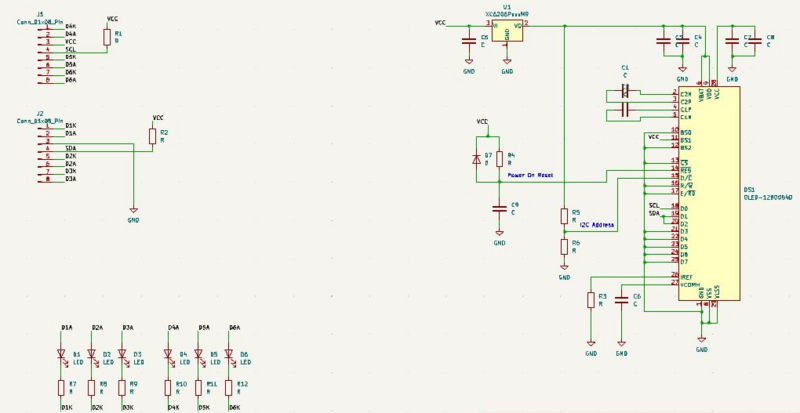
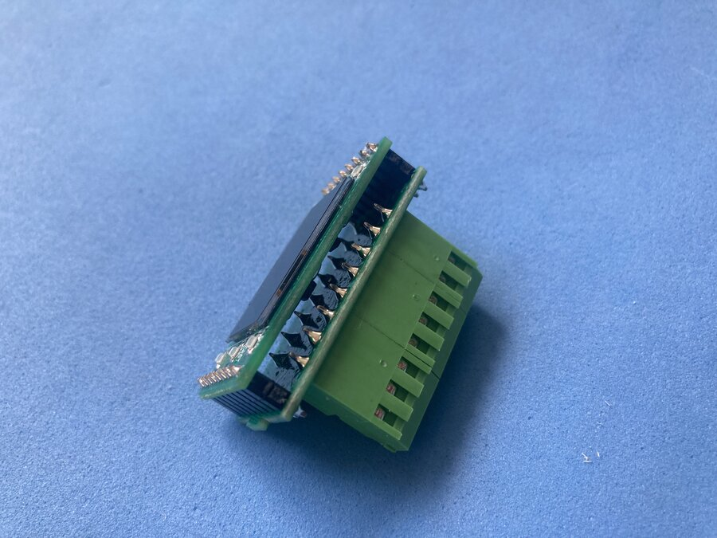
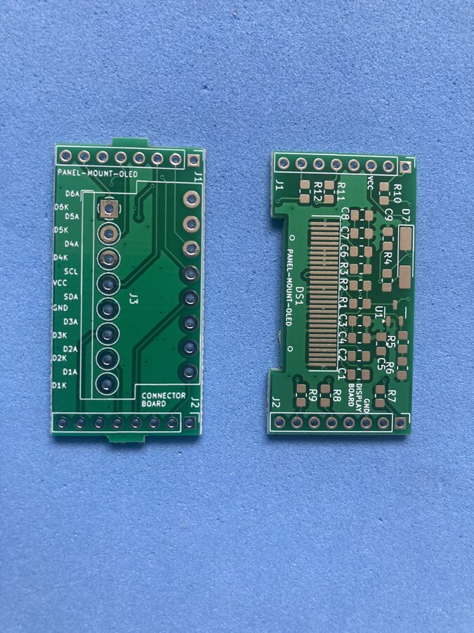

# Panel-mount OLED display — PCB sources

Open-source KiCad designs for a two-board stack that drives a bare 0.96" I2C OLED (128×64) with screw terminals. The boards are meant to fit a 48×29 mm panel-mount enclosure; this repository contains the PCB sources and Gerbers only.

**Full project guide** (assembly, enclosure, BOM with buy links, practical notes):  
[Panel-mount 0.96" bare OLED with screw terminals](https://galopago.github.io/english/panel-mount-oled-display-en/)

## Two-board design

| Board | Folder | Role |
|-------|--------|------|
| Display board | [`display-board/`](display-board/) | Bare OLED flex (handsoldering footprint), XC6206 3.3 V LDO, auto-reset network, I2C coupling, six 0805 indicator LEDs with independent anode/cathode terminals, 1×8 header to the connector board |
| Connector board | [`connector-board/`](connector-board/) | Double-level 2×8 screw terminals (3.5 mm pitch); routes signals to the field wiring |

The stack is joined with 1×8 pin headers and a spacer so the terminals stay reachable from the side.

## Schematic



## Photos





## Repository layout

```
display-board/          KiCad project (.kicad_pro, .kicad_sch, .kicad_pcb)
connector-board/        KiCad project
library/                Custom terminal-block footprints
assets/pdf/             Component and OLED datasheets
assets/img/             Schematic and board photos
```

Gerber archives are under each board folder:

- `*/gerber/single/*.zip` — single-board fabrication
- `*/gerber/panel/*.zip` — panel fabrication

## Ordering PCBs

Upload the Gerber ZIP of your choice to your PCB fab:

| Board | Single | Panel |
|-------|--------|-------|
| Display | [`display-board-single.zip`](display-board/gerber/single/panel-mount-oled-display-display-board-single.zip) | [`display-board-panel.zip`](display-board/gerber/panel/panel-mount-oled-display-display-board-panel.zip) |
| Connector | [`connector-board-single.zip`](connector-board/gerber/single/panel-mount-oled-display-connector-board-single.zip) | [`connector-board-panel.zip`](connector-board/gerber/panel/panel-mount-oled-display-connector-board-panel.zip) |

## Opening in KiCad

Open each `.kicad_pro` file separately (KiCad 7 or newer). The local footprint library in [`library/`](library/) is referenced by the projects.

## Host interface

No on-board firmware. Any host with I2C (Arduino, ESP32, Raspberry Pi Pico, etc.) can drive the SSD1306-compatible display. Wire VCC, GND, SCL, and SDA to the screw terminals; route the six LED pairs to status signals as needed. I2C address selection is configurable on the display board (see schematic).

## What is not in this repo

Enclosure sourcing, step-by-step assembly, and the full bill of materials with purchase links are covered in the [project article](https://galopago.github.io/english/panel-mount-oled-display-en/) linked above.
